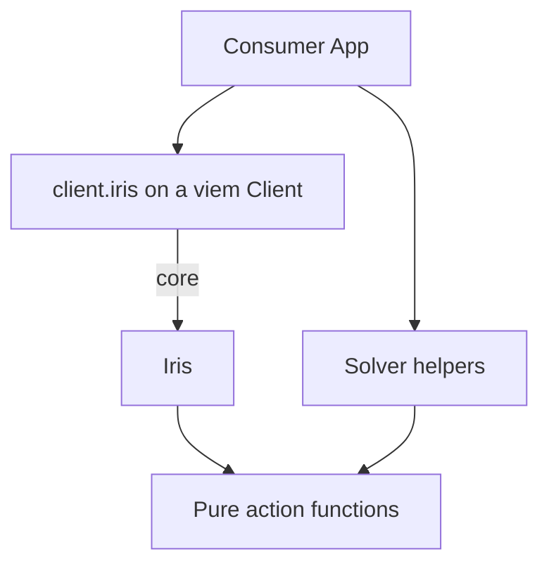

# Architecture

This document explains the design decisions, protocol context, and internal structure of `@iris-credit/iris-sdk`.

## Purpose and Philosophy

The SDK is a TypeScript abstraction layer over the Iris protocol. Its job is to build **ready-to-send transactions** for every Iris flow on EVM-compatible chains, for both sides of a loan: the taker flows a borrower's app drives and the maker (solver) signing flows an RFQ response is made of.

**Design principles:**

- **Deterministic transaction building.** Given the same inputs and on-chain state, the SDK always produces the same `Transaction` object. No simulation, no gas estimation, no sending — the consumer handles those concerns.
- **Predictable developer experience.** Every flow returns a `{ buildTx, getRequirements }` pair (when tokens flow in) or `{ buildTx }` (when they only flow out). The interface is identical across flows.
- **Immutability.** Every returned `Transaction` is deep-frozen via `@iris-credit/iris-ts`'s `deepFreeze`. Once built, a transaction object cannot be mutated. The freeze must never reach caller-owned inputs — `deepFreeze` freezes in place, so objects embedded in `action.args` are copied first (e.g. `irisTake`'s quote).
- **No `any`.** Strict TypeScript throughout, with discriminated unions for action types and a dedicated error class for every failure mode.
- **Mirror the contract, don't re-verify the world.** Flows validate the pure subset of what `Iris.sol` would reject — deadlines, bounds, roles, bitmap membership — as typed errors. Guarantees the RFQ or the contract already verifies (solver signature, enabled configuration, bond requirement) are not re-read at build time. The one stricter-than-contract check: `take` caps the quote's debt at the venue's max borrow for its collateral, measured against the venue LLTV minus `DEFAULT_LLTV_BUFFER` — on Morpho Blue the max borrow LTV _is_ the LLTV, so an uncapped take could open one accrual away from venue liquidation.

The SDK intentionally does **not** simulate or execute transactions. It produces the calldata; the consuming application decides when and how to send it (and can preview it with `@iris-credit/evm-simulation`).

## Layered Architecture



### Why this layering exists

Each layer has a single responsibility and a strict boundary:

| Layer      | Responsibility                                                                                                                                                 | What it must NOT do                           |
| ---------- | --------------------------------------------------------------------------------------------------------------------------------------------------------------- | --------------------------------------------- |
| **Client** | Wrap a viem `Client`, normalize SDK options (`supportSignature`), produce the chain-scoped `Iris` entity                                                        | Call actions directly, hold mutable state     |
| **Entity** | Fetch on-chain data (`getLoanData` / `getPositionData` / `getVenueData` / `getClaimableData`), validate flows against it, compute derived values (funding upper bounds, buffered LLTV ceilings), delegate to actions | Encode calldata, know about bundler internals |
| **Action** | Validate inputs, encode calldata, deep-freeze the result, return a `Transaction<TAction>`                                                                       | Fetch data, hold state, mutate anything       |

**Calls flow strictly downward**: Client → Entity → Action. An action never calls an entity; an entity never instantiates a client.

The solver helpers (`signQuote`, `signResponse`, `signSolverPermit2`, `getSolverRequirements`) sit beside the entity rather than under it: a solver bot signs quotes and manages allowances but never builds taker transactions, so it takes a `WalletClient` directly instead of the extended namespace.

## The Iris Loan

Iris is fixed-rate, fixed-term lending overlaid on variable-rate venues. The SDK models one lifecycle:

- **Take.** A borrower and a solver agree terms off-chain as an EIP-712 signed `Quote`, delivered through the RFQ. `take` opens the loan: the borrower's collateral enters a single-use **pod** on the quoted venue, the debt is borrowed against it, and the solver posts a **bond** in the debt token covering the spread between the fixed rate the borrower pays and the floating rate the venue charges.
- **Servicing.** While the loan is open, collateral and bond can be topped up permissionlessly (`supplyCollateral`, `supplyBond` — anyone can fund them), and withdrawn by their owners (`withdrawCollateral` by the borrower, `withdrawBond` by the solver) down to health ceilings Iris re-checks on-chain.
- **Resolution.** `repay` closes the loan — always in full, priced at execution as the legs accrue per second, permissionless. Past `maturity + overduePeriod` the loan is instead liquidatable. Either way the loan becomes **resolved**: settlement credits the solver's net and surplus, and the protocol's fees, to claimable balances drawn down with `claim`.
- **After resolution.** The pod may still hold a venue position (repay leaves the collateral with it). `escape` exits it: the borrower settles any remaining venue debt and withdraws the venue collateral, yield included. `close` fuses the two legs into one bundle.
- **Refinance.** At any time while open, the solver can move the position to another venue enabled in the loan's `venueBitmap` — `refinance` clears the current venue's debt and re-enters the new one atomically.

Two facts shape the SDK's flows:

- **Roles are pinned by the contract.** `take` and `escape` run on the borrower's Iris authorization; `withdrawCollateral` is the borrower's, `withdrawBond` and `refinance` the solver's. The entity validates `userAddress` against the pinned role at build time (builder = signer).
- **Amounts owed accrue per second.** Any flow that funds an accruing pull (`repay`, `escape`, `refinance`) cannot fund the fetched amount — see the funding pattern below.

## Bundled vs Direct Calls

This is the most important routing decision in the SDK.

### Flows that move tokens in: always through the bundler

`take`, `repay`, `close`, `supplyCollateral`, `supplyBond`, `escape` and `refinance` are routed through **Bundler3** via its **general adapter** (`GeneralAdapter1`). The bundle atomically:

1. _(If a signed Iris authorization is provided)_ Submits it via `irisSetAuthorizationWithSig`, granting the general adapter operator rights for the flow's pinned role in the same transaction.
2. _(If `nativeAmount` is provided)_ Transfers native token to the general adapter via `nativeTransfer`, then wraps it to wNative via `wrapNative`; the transaction's `value` carries it. Only valid when the funded asset is the chain's wNative.
3. Transfers the user's ERC-20 tokens to the general adapter (via `erc20TransferFrom`, permit, or permit2).
4. Calls the Iris action (`irisTake`, `irisRepay`, …), which pulls the funding out of the adapter.
5. _(On accruing pulls)_ Sweeps the adapter's remaining balance back to the receiver via `erc20Transfer`.

**Why the bundler is mandatory here:** Iris pulls funding from `msg.sender`'s side atomically with the call, so the funding transfer and the Iris call must share a transaction; the bundle is also what lets a permit, a Permit2 approval, or an Iris authorization signature ride along instead of costing a standalone transaction. On `take`, it additionally submits the solver's Permit2 bond payload (`approve2Iris`) so the bond pull — which Iris takes from the solver directly, never from the adapter — succeeds through the Permit2 fallback.

**The funding upper-bound + sweep pattern:** Iris prices accruing pulls at execution. Funding the amount owed at fetch time would under-fund the pull and revert, so `repay`, `close`, `escape` and `refinance` size the funding from the position projected **two hours** past now, and a final sweep returns whatever the pull left behind. The projection doubles as the transaction's validity window — rebuild after two hours rather than sending a stale one. `repay` and `close` add one unit of rounding headroom (`REPAY_ROUNDING_HEADROOM`) on top: before maturity the settled fixed leg is two separately floored terms of a fixed total, so the projection re-rounds the split rather than bounding it, and the contract's figure at the mined block can sit one unit above it.

**Security invariant:** Never bypass the general adapter for funded flows.

The bundle is encoded via the local `BundlerAction.encodeBundle(chainId, actions)` helper. The `to` address of the resulting transaction is always the Bundler3 contract address for the target chain.

### Flows that only move tokens out: direct Iris calls

`withdrawCollateral`, `withdrawBond` and `claim` are **direct calls** to the Iris contract. No bundler, no general adapter, no approval.

**Why no bundler?** Nothing is pulled from the caller, so there is no funding to make atomic and no approval to fold in. Direct calls avoid the overhead; the caller (`msg.sender`) must simply be the pinned role — or be authorized by it on Iris.

The withdrawals are validated locally against the ceiling Iris re-checks on-chain, measured with a 0.5% buffer (`DEFAULT_LLTV_BUFFER`) below the venue LLTV (collateral) or the loan's bond LLTV (bond), so a withdrawal sized to the fetched state still clears the check once it lands.

### Summary

| Operation            | Route                      | Why                                                                                                            |
| -------------------- | -------------------------- | --------------------------------------------------------------------------------------------------------------- |
| `take`               | Bundler3 (general adapter) | Atomic authorization + collateral funding + `irisTake`; submits the solver's Permit2 bond payload (`approve2Iris`). |
| `repay`              | Bundler3 (general adapter) | Full repay priced at execution: fund a 2h upper bound, sweep the residual back. Permissionless.                  |
| `close`              | Bundler3 (general adapter) | `repay` then `escape` in one bundle: Iris's repay leaves the collateral on the venue. Borrower only.             |
| `supplyCollateral`   | Bundler3 (general adapter) | `erc20TransferFrom` + `irisSupplyCollateral`. Optional native wrapping. Permissionless.                          |
| `supplyBond`         | Bundler3 (general adapter) | `erc20TransferFrom` + `irisSupplyBond` in the debt token. Optional native wrapping. Permissionless.              |
| `escape`             | Bundler3 (general adapter) | Funds residual venue debt (2h upper bound), settles, withdraws venue collateral + yield. Borrower only.          |
| `refinance`          | Bundler3 (general adapter) | Funds current venue debt (2h upper bound), re-enters the new venue, returns proceeds. Solver only.               |
| `withdrawCollateral` | Direct Iris call           | Nothing flows in. Ceiling = min(Iris check, venue check) against the buffered venue LLTV. Borrower only.         |
| `withdrawBond`       | Direct Iris call           | Nothing flows in. Post-withdrawal bond health against the buffered bond LLTV. Solver only.                       |
| `claim`              | Direct Iris call           | Nothing flows in. Validated against the claimable balance; defaults to claiming it all.                          |

## Dependency Map

The SDK builds on the Iris TypeScript ecosystem. Each dependency has a specific role:

```
iris-sdk
├── @iris-credit/core-sdk    Protocol model: entities, fetchers, ABIs, addresses, constants, typed data
├── @iris-credit/iris-ts     Shared utilities (deepFreeze, Time, isDefined)
└── viem                     Ethereum client and ABI encoding (the only peer dependency)
```

### `@iris-credit/core-sdk`

Protocol-level model, constants and reads:

- **Entities** — `Loan`, `AccrualPosition`, `Venue`: the pre-fetched inputs every flow takes. Their offline accrual math (`repay(timestamp)`, `refinance(venue, timestamp)`, `getAccrualDebt`) is what the entity layer uses to size funding upper bounds and replay contract rejections locally.
- **Fetchers** — `fetchLoan`, `fetchAccrualPosition`, `fetchVenue`, `fetchClaimable`: wrapped by the entity's `get*Data` getters.
- **`getChainAddresses(chainId)`** — resolves the Iris core, `bundler3.generalAdapter1`, `permit2`, `wNative` and token addresses. **`getChainRegistry(chainId)`** — what is enabled on Iris: venue ids and market data payloads (used to pick refinance targets).
- **Protocol constants and math** — `MAX_FIXED_RATE`, `MIN_DURATION` / `MAX_DURATION`, `MAX_OVERDUE_RATE` / `MAX_OVERDUE_PERIOD`, `BP` (quote-bound validation), `MathLib` (`zeroFloorSub`, `max`, `MAX_UINT_160`).
- **Typed data and ABIs** — `getQuoteTypedData`, `getPermit2PermitTypedData`, `irisAbi`, `erc2612Abi`, `permit2Abi`: EIP-712 payloads for the solver helpers and signable requirements, ABIs for direct-call encoding and allowance reads.

### `@iris-credit/iris-ts`

Shared utilities:

- **`deepFreeze`** — recursively freezes objects. Applied to every returned `Transaction` and signed payload.
- **`Time`** — timestamp helpers used for deadline checks and the two-hour funding projection.
- **`isDefined`** — type-narrowing utility used in the requirements decision tree.

### Local Bundler Encoding

Bundle encoding lives in this package (`src/bundler/`):

- **`BundlerAction.encodeBundle(chainId, actions)`** — takes an array of bundler `Action` objects (e.g. `erc20TransferFrom`, `permit`, `approve2`, `approve2Iris`, `irisTake`, `irisRepay`, `wrapNative`) and encodes them into a single calldata blob targeting the Bundler3 contract.
- **`Action` type** — the typed action union used inside bundles. Permit2 payloads carry no `spender` field: the encoder always injects the general adapter (`approve2`) or the Iris core (`approve2Iris`), so a signature can never approve an arbitrary spender.
- **ABI literals** for `bundler3`, `generalAdapter1` and `ethereumGeneralAdapter1` live in `src/abis/`; everything protocol-level comes from `core-sdk`.

## Requirements System

Before a funded flow executes, the user must grant the **general adapter** permission to pull their ERC-20 tokens — and, on `take` / `escape` / `refinance`, the pinned role must have authorized the general adapter on Iris. The requirements system resolves what approvals, signatures, or authorizations are needed.

### Why token requirements target the general adapter, not Iris

Funding always flows: **user → general adapter → Iris**. The general adapter is the contract that calls `transferFrom` on the user's tokens, then makes the Iris call that pulls them out of the adapter. Therefore the **spender** in any approval / permit is always `bundler3.generalAdapter1` for the target chain. The one exception is the solver's bond: `Iris.take` pulls it from the solver directly via `safeTransferFrom2`, so solver-side allowances target the Iris core (or the Permit2 contract) — see below.

### Decision tree

```
getGeneralAdapterRequirements(viemClient, params)
│
├─ amount === 0n
│    └─► [] (nothing to pull — e.g. fully native funding, or an escape with no venue debt)
│
├─ supportSignature: false (default)
│    └─► getRequirementsApproval()
│         Spender: generalAdapter1
│         Returns: Transaction<ERC20ApprovalAction>[]
│         • Checks current allowance — skips if sufficient.
│         • For APPROVE_ONLY_ONCE_TOKENS (e.g. USDT): prepends a reset-to-zero
│           approval before the actual approval.
│         • The encoder caps per-token approvals (MAX_TOKEN_APPROVALS, e.g. uint96 tokens).
│
└─ supportSignature: true
     │
     ├─ useSimplePermit: true AND token verified in SIMPLE_PERMIT_TOKENS (never DAI)
     │  AND ERC-2612 nonce probe succeeds
     │    └─► getGeneralAdapterRequirementsPermit()
     │         Returns: Requirement[] with sign() → permit
     │         • Always exact-amount, never skipped: an ERC-2612 permit overwrites
     │           the allowance and the bundle spends exactly `amount`, so no
     │           residual allowance is left behind.
     │
     └─ otherwise (Permit2 exists on this chain)
          └─► getGeneralAdapterRequirementsPermit2()
               Returns: (Transaction | Requirement)[]
               Two-step:
               1. ERC20 → Permit2: classic approve() if needed (infinite).
               2. Permit2 → generalAdapter1: exact-amount allowance signature
                  (the tuple's nonce is read, the amount is never skipped).
```

The simple-permit gate has two halves: the token must be verified in core-sdk's `SIMPLE_PERMIT_TOKENS` — the per-chain allowlist recording the EIP-712 domain `version` each one signs, checked against the live `DOMAIN_SEPARATOR()` — and it must expose a readable `nonces(owner)`. An unverified token routes to Permit2 without even the probe, since signing a guessed domain reverts at execution. `useSimplePermit` left unset (or `false`) is the escape hatch for tokens that pass both checks but are still incompatible; DAI's non-standard permit is a built-in case of that and always falls through to Permit2.

### The Iris authorization requirement

`getIrisAuthorizationRequirement` reads `Iris.isAuthorized(user, generalAdapter1)` and returns `null` when authorization is already in place — which a previous bundled `take` leaves behind. Otherwise:

- **Default** — the `setAuthorization(generalAdapter1, true)` transaction the user sends before the bundle.
- **`supportSignature: true`** — a signable `Requirement`; the signed authorization is folded into the bundle via `irisSetAuthorizationWithSig`, removing the standalone transaction. Iris authorization nonces are unordered, so no nonce read is needed — the requirement signs with a random nonce.

The encoder (`getIrisAuthorizationAction`) rejects any signed authorization whose `authorized` account is not the chain's general adapter (`BundlerErrors.UnexpectedSignature`), so a stray signature can never grant operator rights to an unintended address.

### Solver-side requirements

The maker-flow counterpart, resolved by `getSolverRequirements`. `Iris.take` pulls the bond from the solver via `safeTransferFrom2`, funded in one of two modes:

- **Standing allowance (default)** — a direct ERC-20 approval to the Iris core, consumed take after take. One approval, no per-quote signing.
- **Permit2 (`usePermit2: true`)** — a one-time ERC-20 approval to the Permit2 contract; the Permit2-managed allowance itself is granted in-bundle by each quote's signed `solverPermit2` payload. Permit2 nonces are sequential per `(solver, token, spender)`, so concurrent outstanding quotes race — solvers quoting at volume should prefer the standing allowance.

Requirements cover allowances only; the solver's debt-token balance is gated separately by the bot.

### How signatures flow into `buildTx`

When requirements return a `Requirement` object, the consuming application calls `requirement.sign(client, userAddress)` — which enforces builder = signer against the client's account — to obtain a `RequirementSignature`. The collected signatures are then passed to `buildTx` as an array, letting a permit and an Iris authorization travel together:

```
getRequirements() → Requirement { sign() } → RequirementSignature → buildTx([sig, ...])
```

Inside `buildTx`, `selectRequirementSignatures` splits the array into its typed slots — at most one permit and one authorization, rejecting ambiguous or unexpected kinds instead of silently dropping them — and `getTokenRequirementActions` converts the token signature into bundler actions:

- **Permit path**: `permit` action + `erc20TransferFrom` to the general adapter.
- **Permit2 path**: `approve2` action + `transferFrom2` to the general adapter.

The authorization signature becomes an `irisSetAuthorizationWithSig` action prepended to the Iris operation. These funding actions are composed in on-chain execution order ahead of the Iris action; the entire sequence executes atomically in one transaction.

When no signature is provided (classic approval path), `buildTx()` uses a plain `erc20TransferFrom` to move tokens from the user to the general adapter before the Iris call.

### Guard functions

Type guards distinguish requirement types in application code:

- `isRequirementApproval(r)` — true when `r` is a `Transaction<ERC20ApprovalAction>` (send as tx).
- `isRequirementIrisAuthorization(r)` — true when `r` is a `Transaction<IrisAuthorizationAction>` (send as tx).
- `isRequirementSignature(r)` — true when `r` is a `Requirement` (needs signing first).

And on the signed side, `isPermitSignature` / `isAuthorizationSignature` narrow a `RequirementSignature` to its kind.
