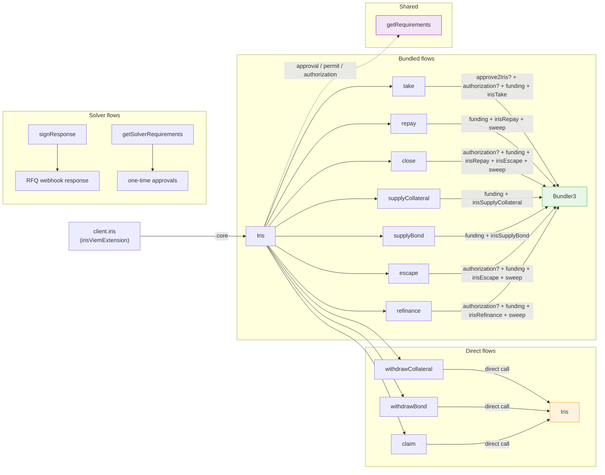

# @iris-credit/iris-sdk

<a href="https://www.npmjs.com/package/@iris-credit/iris-sdk">
    <picture>
        <source media="(prefers-color-scheme: dark)" srcset="https://img.shields.io/npm/v/@iris-credit/iris-sdk?colorA=21262d&colorB=21262d&style=flat">
        
    </picture>
</a>
<a href="https://github.com/iris-credit/iris-sdks/blob/main/packages/iris-sdk/LICENSE">
    <picture>
        <source media="(prefers-color-scheme: dark)" srcset="https://img.shields.io/npm/l/@iris-credit/iris-sdk?colorA=21262d&colorB=21262d&style=flat">
        
    </picture>
</a>
<a href="https://www.npmjs.com/package/@iris-credit/iris-sdk">
    <picture>
        <source media="(prefers-color-scheme: dark)" srcset="https://img.shields.io/npm/dm/@iris-credit/iris-sdk?colorA=21262d&colorB=21262d&style=flat">
        
    </picture>
</a>
<br />
<br />

## Overview

> **The abstraction layer that simplifies the Iris protocol**

Build ready-to-send transactions for every Iris flow — `take`, `repay`, `close`, collateral and bond management, `claim`, `escape` and `refinance` — plus the solver-side signing helpers an RFQ quote response is made of.

Everything hangs off one chain-scoped entity, created from an extended viem client:

```typescript
import { createWalletClient, http, publicActions } from "viem";
import { mainnet } from "viem/chains";
import { irisViemExtension } from "@iris-credit/iris-sdk";

const client = createWalletClient({
  chain: mainnet,
  transport: http(),
  account: user,
})
  .extend(publicActions)
  .extend(irisViemExtension({ supportSignature: true }));

const iris = client.iris.core(1);
```

The namespace is stateless — no `init()`, no cache, no warm-up. It rides on top of the viem client the integrator owns, so reads and writes share one transport, chain and account. Each flow validates locally what `Iris.take` (or its sibling) would reject, resolves its on-chain prerequisites lazily, and encodes the final transaction synchronously.

## Installation

```bash
npm install @iris-credit/iris-sdk viem
```

```bash
yarn add @iris-credit/iris-sdk viem
```

`viem` (`^2`) is the only peer dependency — [`@iris-credit/core-sdk`](../core-sdk/) and [`@iris-credit/iris-ts`](../iris-ts/) ship as regular dependencies.

## Usage

### Entities & Actions

All flows live on the chain-scoped entity returned by `client.iris.core(chainId)`:

| Action               | Route                     | Why                                                                                                                                                                                                                                                                                                                              |
| -------------------- | ------------------------- | -------------------------------------------------------------------------------------------------------------------------------------------------------------------------------------------------------------------------------------------------------------------------------------------------------------------------------- |
| `take`               | Bundler (general adapter) | Opens a loan from a solver-signed quote: submits the solver's Permit2 bond funding (`approve2Iris`), folds in the borrower's Iris authorization (`setAuthorizationWithSig`), funds the collateral, then `irisTake`. The bond is pulled by Iris from the solver directly, never from the adapter. Supports native token wrapping. |
| `repay`              | Bundler (general adapter) | Iris repays in full at a price that accrues per second, so the bundle funds an upper bound (the position projected two hours forward) and sweeps the residual back. Permissionless — anyone can close the loan.                                                                                                                  |
| `close`              | Bundler (general adapter) | `repay` then `escape` in one bundle: settles the loan and exits the venue position it leaves funded, returning collateral — yield included — and the swept residual to the borrower. Borrower only.                                                                                                                              |
| `supplyCollateral`   | Bundler (general adapter) | `erc20TransferFrom` + `irisSupplyCollateral`. Permissionless top-up. Supports native token wrapping.                                                                                                                                                                                                                             |
| `withdrawCollateral` | Direct Iris call          | No bundler overhead. Validates the withdrawal against both Iris's ceiling and the venue's own (which Iris's does not imply), measured against the buffered venue LLTV. Borrower only.                                                                                                                                            |
| `supplyBond`         | Bundler (general adapter) | `erc20TransferFrom` + `irisSupplyBond` in the loan's debt token — the asset the bond is denominated in. Permissionless top-up. Supports native token wrapping.                                                                                                                                                                   |
| `withdrawBond`       | Direct Iris call          | No bundler overhead. Validates post-withdrawal bond health against the buffered bond LLTV. Solver only.                                                                                                                                                                                                                          |
| `claim`              | Direct Iris call          | No bundler overhead. Validates the claim against the claimable balance — `Iris.claim` has no max-sweep sentinel, so `amount` defaults to the whole balance.                                                                                                                                                                      |
| `escape`             | Bundler (general adapter) | Exits a resolved loan's venue position: funds the venue debt (projected two hours forward), settles it, withdraws the venue collateral — yield included — and sweeps the residual back. Borrower only.                                                                                                                           |
| `refinance`          | Bundler (general adapter) | Moves the position to another venue: funds the current venue debt (projected two hours forward), replays the migration locally to reject what the contract rejects, and returns the new venue's borrow proceeds. Solver only.                                                                                                    |

Solver-side (maker-flow) helpers are standalone functions:

| Helper                  | Why                                                                                                                                                  |
| ----------------------- | ---------------------------------------------------------------------------------------------------------------------------------------------------- |
| `getSolverRequirements` | Resolves the one-time approvals a solver must send before quoting, for either bond funding mode.                                                     |
| `signResponse`          | The per-quote hot path: signs the quote and (in the Permit2 mode) the bond funding payload in one call — everything an RFQ webhook response carries. |
| `signQuote`             | Signs a quote verbatim as the solver — the EIP-712 signature `Iris.take` verifies on-chain.                                                          |
| `signSolverPermit2`     | Signs the per-quote Permit2 payload funding the bond pull, spender pinned to the Iris core.                                                          |

### Reads

Flows are fetch-first: each takes the pre-fetched data it needs — `loanData`, `positionData`, `newVenue` or `claimableData` — from the entity's getters, so one fetch can feed several builds and a stale build never hides a fetch.

```typescript
const loanData = await iris.getLoanData(pod); // the pod's Loan — parties, tokens, terms.
const positionData = await iris.getPositionData(pod); // AccrualPosition — position + loan + venue.
const claimableData = await iris.getClaimableData(account, token); // claimable balance (bigint).
const newVenue = await iris.getVenueData({ ...loanData, venueId, data }); // a venue's live view of the pod.
```

`getPositionData` reads the whole venue state; prefer `getLoanData` for flows that only need the loan, and hand an `AccrualPosition`'s `.loan` to those flows instead of re-fetching. Every getter accepts optional `FetchParameters` (`blockNumber`, `blockTag`, `stateOverride`) for historical or state-overridden reads.

### The `getRequirements` flow

Every flow that moves tokens into the protocol returns two things:

- `buildTx(signatures?)` — builds the final `Transaction` object (`to`, `value`, `data`, plus a typed `action` discriminator), synchronously. Takes the collected signature results the flow consumes: permit / Permit2 and, on `take` / `close` / `escape` / `refinance`, the Iris authorization.
- `getRequirements()` — returns the list of on-chain prerequisites that must be satisfied first.

Typical requirements:

- **ERC-20 approval** — the user must approve `GeneralAdapter1` (or, in the Permit2 flow, the Permit2 contract) to pull tokens. Returned as a standard `approve` transaction the consumer sends first.
- **Permit / Permit2 signature** — off-chain approvals that go into `buildTx` in the `signatures` array, avoiding the extra approval transaction. Enabled via `irisViemExtension({ supportSignature: true })`; pass `useSimplePermit: true` to `getRequirements` to prefer an EIP-2612 permit for tokens verified in core-sdk's `SIMPLE_PERMIT_TOKENS` allowlist (unverified tokens fall through to Permit2).
- **Iris authorization** — bundled paths that operate on a user's loan require that user to authorize `GeneralAdapter1` on Iris: `take`, `close` and `escape` need the borrower's authorization, `refinance` the solver's. Returned as a `setAuthorization` transaction — or, with `supportSignature`, as a signable requirement folded into the bundle via `setAuthorizationWithSig` — and omitted when the authorization is already in place.

Usage pattern:

```typescript
import { isRequirementSignature } from "@iris-credit/iris-sdk";

const { buildTx, getRequirements } = iris.take({/* ... */});

const requirements = await getRequirements();
// → [{ to, value, data, action }, { sign: async () => {...}, action }]

const signatures = [];
for (const requirement of requirements) {
  if (isRequirementSignature(requirement)) {
    signatures.push(await requirement.sign(client, userAddress));
  } else {
    await client.sendTransaction(requirement); // approval / setAuthorization transaction.
  }
}

const tx = buildTx(signatures);
```

`isRequirementApproval` and `isRequirementIrisAuthorization` narrow the transaction requirements further when the two must be handled differently. `buildTx` consumes at most one permit and one authorization signature — passing several of a kind, or a kind the flow does not consume, throws (`AmbiguousRequirementSignaturesError` / `UnexpectedRequirementSignatureError`) instead of silently dropping a signed requirement.

### Integration invariant — builder = signer

**`userAddress` MUST equal the account that ends up signing / executing the transaction.** Action-layer transaction builders do not validate this at build time, so callers MUST keep `userAddress` aligned with the signing account themselves. The entity enforces it wherever the contract pins a role: `take`, `close` and `escape` require `userAddress` to be the borrower (whose Iris authorization the bundle runs on), `withdrawCollateral` the borrower, and `withdrawBond` / `refinance` the loan's solver. The signature requirements (`encodeErc20Permit` / `encodeErc20Permit2Approve` / `encodeIrisSignatureAuthorization`) take a `WalletClient` and enforce the invariant at `sign()` time via `validateUserAddress`, rejecting any `sign(client, userAddress)` where `client.account.address !== userAddress` with `MissingClientPropertyError` / `AddressMismatchError`.

### Take

Opens a loan from a solver-signed quote. The quote, its signature and (for solvers without a standing allowance) the `solverPermit2` payload are delivered through the RFQ; validation is local-only — the pure subset of `Iris.take`'s requires — since the RFQ already validated the quote and the contract re-verifies everything at execution. On top of that, the quote is measured against the pre-fetched `venueData` (`getVenueData(quote)` — the quote carries its venue's identifying fields): the debt must fit the venue's max borrow for the collateral, capped by the venue LLTV minus a 0.5% buffer (`DEFAULT_LLTV_BUFFER`) so the loan does not open one accrual away from venue liquidation — on Morpho Blue the max borrow LTV _is_ the LLTV.

```typescript
const venueData = await iris.getVenueData(quote); // the quote carries its venue: id, tokens, market data.

const { buildTx, getRequirements } = iris.take({
  userAddress: borrower, // must be quote.borrower.
  quote,
  quoteSignature,
  venueData,
  solverPermit2, // optional — delivered with the quote.
});

const requirements = await getRequirements({ useSimplePermit: true });
const tx = buildTx(signatures);
```

#### Take with native collateral

For quotes whose collateral token is the chain's wNative, part (or all) of the collateral can be paid natively and wrapped in-bundle; the ERC-20 pull covers the remainder and the transaction's `value` carries the native amount:

```typescript
const venueData = await iris.getVenueData(quote); // the quote carries its venue: id, tokens, market data.

const { buildTx, getRequirements } = iris.take({
  userAddress: borrower,
  quote,
  quoteSignature,
  venueData,
  nativeAmount: 1000000000000000000n, // 1 ETH of the collateral, wrapped to WETH in-bundle.
});
```

The same `nativeAmount` parameter funds the debt token on `repay` / `close` / `escape` / `refinance` and the deposit on `supplyCollateral` / `supplyBond`, always requiring the funded asset to be the chain's wNative.

### Repay

Closes the loan in full. Iris prices the debt at execution — the amount owed accrues per second — so the bundle funds the position projected two hours forward and a final sweep returns whatever the pull left behind. The projection doubles as the transaction's validity window: rebuild after two hours rather than sending a stale one.

```typescript
const positionData = await iris.getPositionData(pod);

const { buildTx, getRequirements } = iris.repay({
  userAddress: payer, // anyone — repay is permissionless; the sweep returns here.
  positionData,
});

const requirements = await getRequirements();
const tx = buildTx([permitSignature]);
```

Repay resolves the loan but leaves the collateral with the position — recover it with `escape`, or do both in one bundle with `close`.

### Close

Resolves the loan and exits its venue position in one bundle — `repay` then `escape` — so the collateral repay leaves behind comes back atomically, yield included. The repayment leg funds the position projected two hours forward and sweeps the residual back, exactly as `repay` sizes it; the projection doubles as the validity window — rebuild after two hours rather than sending a stale one. The exit rides on `Iris.escape` rather than `withdrawCollateral`: escape sends the venue balance as it stands at execution, where an exact amount a rebase invalidated would revert or strand dust. Unlike the permissionless `repay`, close is borrower-only — `GeneralAdapter1.irisEscape` pins the borrower to the bundle initiator, and the escape leg runs on their Iris authorization. A loan already **resolved** leaves nothing to repay and throws `LoanResolvedError` — reach for `escape` on its own to recover the collateral.

```typescript
const positionData = await iris.getPositionData(pod);

const { buildTx, getRequirements } = iris.close({
  userAddress: borrower, // must be the loan's borrower — receives the collateral and the sweep.
  positionData,
});

const requirements = await getRequirements();
const tx = buildTx(signatures);
```

### Supply Collateral

```typescript
const loanData = await iris.getLoanData(pod);

const { buildTx, getRequirements } = iris.supplyCollateral({
  userAddress: payer, // anyone — the supply is permissionless.
  loanData,
  amount: 50000000n, // 0.5 cbBTC.
});

const requirements = await getRequirements();
const tx = buildTx([permitSignature]);
```

### Withdraw Collateral

Direct call to `Iris.withdrawCollateral` — no bundler, no approval, no authorization requirement (the collateral flows out of the venue, not in). The withdrawal is validated against both ceilings — Iris's health check and the venue's own — measured against the venue LLTV minus a 0.5% buffer (`DEFAULT_LLTV_BUFFER`) so a withdrawal sized to the fetched state still clears them once it lands.

```typescript
import { Time } from "@iris-credit/iris-ts";

const positionData = await iris.getPositionData(pod);

const { buildTx } = iris.withdrawCollateral({
  userAddress: borrower, // must be the loan's borrower (or authorized by them on Iris).
  positionData: positionData.accrueLegs(Time.timestamp()).rebase(), // ceilings are measured on it as given.
  amount: 50000000n, // 0.5 cbBTC.
});

const tx = buildTx();
```

### Supply Bond

```typescript
const loanData = await iris.getLoanData(pod);

const { buildTx, getRequirements } = iris.supplyBond({
  userAddress: payer, // anyone — the supply is permissionless.
  loanData, // the bond is denominated in loanData.debtToken.
  amount: 1_000_000000n, // 1k USDC.
});

const requirements = await getRequirements();
const tx = buildTx([permitSignature]);
```

### Withdraw Bond

Direct call to `Iris.withdrawBond`. The remaining bond must cover the bond requirement and the solver's negative net, measured against the loan's bond LLTV minus `DEFAULT_LLTV_BUFFER`.

```typescript
const positionData = await iris.getPositionData(pod);

const { buildTx } = iris.withdrawBond({
  userAddress: solver, // must be the loan's solver (or authorized by them on Iris).
  positionData,
  amount: 1_000_000000n, // 1k USDC.
});

const tx = buildTx();
```

### Claim

Draws down a claimable Iris balance — where settlement credits the solver's net and surplus, and the fee recipient's fees. Direct call to `Iris.claim`; `amount` defaults to the whole balance.

```typescript
const claimableData = await iris.getClaimableData(solver, debtToken);

const { buildTx } = iris.claim({
  userAddress: solver, // whose balance is drawn down and who receives the tokens.
  token: debtToken,
  claimableData,
});

const tx = buildTx();
```

### Escape

Exits the venue position of a **resolved** loan (`bondRequirement === 0n`): the bundle funds the pod's live venue debt (projected two hours forward, residual swept back), settles it, and withdraws the venue collateral — yield included — to `userAddress`. The venue usually carries no debt after a repay or liquidation, in which case the funding requirement comes back empty.

```typescript
const positionData = await iris.getPositionData(pod);

const { buildTx, getRequirements } = iris.escape({
  userAddress: borrower, // must be the loan's borrower.
  positionData,
});

const requirements = await getRequirements();
const tx = buildTx(signatures);
```

### Refinance

Moves the loan's position to another venue enabled in the loan's `venueBitmap`. The migration is replayed locally against `positionData` and `newVenue` to reject what the contract rejects; the bundle then funds the debt the pod owes its current venue (projected two hours forward — Iris clears it out of `GeneralAdapter1`'s balance before the new venue is entered, so the funding cannot come from the refinance itself), and the new venue's borrow proceeds plus the swept residual return to `userAddress`, leaving it whole.

```typescript
import { ChainId, getChainRegistry, getMarketData } from "@iris-credit/core-sdk";

const { venues } = getChainRegistry(ChainId.EthMainnet);

const positionData = await iris.getPositionData(pod);
const newVenue = await iris.getVenueData({
  ...positionData.loan,
  venueId: venues.morphoBlue,
  // The target venue's market data payload, looked up by its Morpho market id.
  data: getMarketData(ChainId.EthMainnet, marketId).data,
});

const { buildTx, getRequirements } = iris.refinance({
  userAddress: solver, // must be the loan's solver.
  positionData,
  newVenue,
});

const requirements = await getRequirements();
const tx = buildTx(signatures);
```

> [!NOTE]
> Whether the new venue's `data` payload is enabled on Iris is not read here; the contract rejects a disabled payload at execution. Check it upfront with `fetchIsDataEnabled` from `@iris-credit/core-sdk`.

### Solver flows

The maker-flow counterpart of everything above. `Iris.take` pulls the bond from the solver via `safeTransferFrom2`, funded in one of two modes: a **standing allowance** (a one-time ERC-20 approval to the Iris core, consumed take after take) or a **per-quote Permit2 payload** (a one-time approval to the Permit2 contract, then one signed payload per quote, submitted in-bundle by the taker).

```typescript
import { QUOTE_TTL, randomNonce } from "@iris-credit/core-sdk";
import { Time } from "@iris-credit/iris-ts";
import { getSolverRequirements, signResponse } from "@iris-credit/iris-sdk";

// Bot startup — send the one-time approvals for the chosen funding mode:
const requirements = await getSolverRequirements(client, {
  chainId: 1,
  solver,
  debtToken,
  bond: maxQuoteSize,
  usePermit2: true,
});
for (const tx of requirements) await client.sendTransaction(tx);

// Per-quote hot path — sign everything the RFQ webhook response carries:
const quote = { ...terms, deadline: Time.timestamp() + QUOTE_TTL, nonce: randomNonce() };

const { quoteSignature, solverPermit2 } = await signResponse(client, {
  chainId: 1,
  quote,
  usePermit2: true,
});
// Respond to the RFQ webhook with { ...quote fields, signature: quoteSignature, solverPermit2 }.
```

`signResponse` derives the Permit2 payload from the quote itself (`solver`, `debtToken`, `bond`), so it can never mismatch the quote it accompanies, and scopes its signature deadline to `quote.deadline` — an unfilled quote's permit becomes unsubmittable once the quote dies, while a submitted allowance is always signed with the maximum `expiration`, mimicking a standing approval. Requirements cover allowances only: gate quoting on the solver's debt-token balance separately, and re-check as takes consume it.

> [!NOTE]
> Permit2 nonces for `(solver, debtToken, Iris)` are sequential, so concurrent outstanding quotes race — only the first take can consume its permit. Solvers quoting at volume should prefer the standing-allowance mode and skip the payload entirely.

### Architecture

Design decisions, protocol context, and the requirements system internals are documented in [`ARCHITECTURE.md`](./ARCHITECTURE.md).



## Development

Contribute from the monorepo root. See [CONTRIBUTING.md](../../CONTRIBUTING.md) for setup, checks, and package workflow. Report vulnerabilities through [SECURITY.md](../../SECURITY.md).

## License

MIT. See [LICENSE](./LICENSE).
